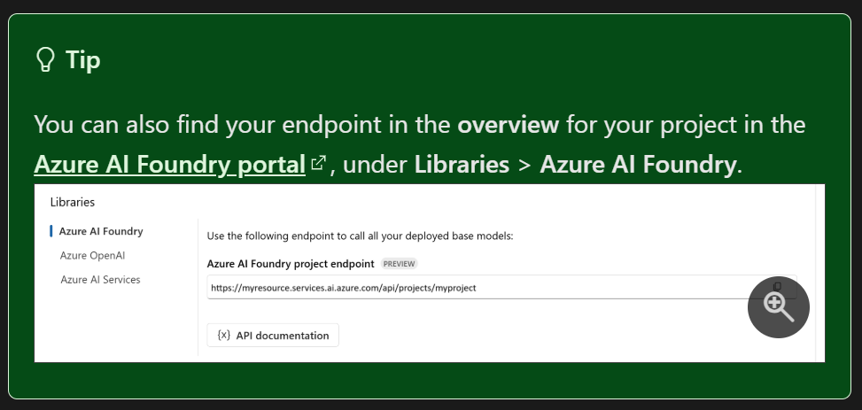
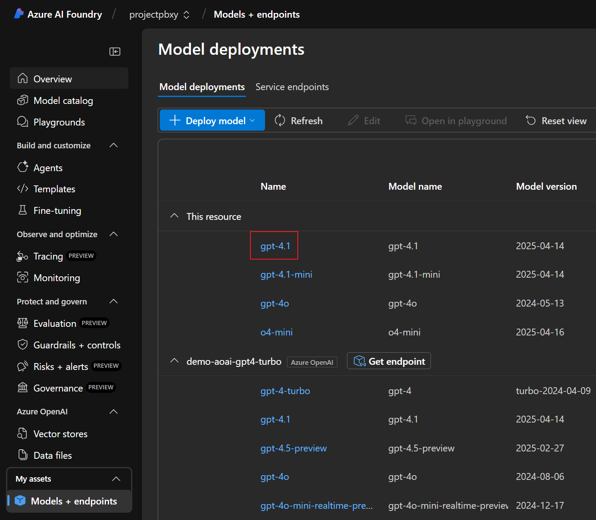
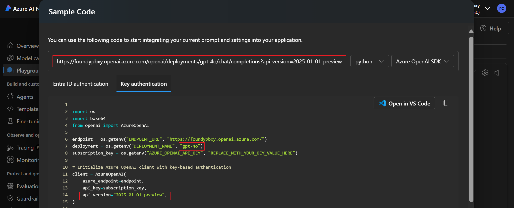
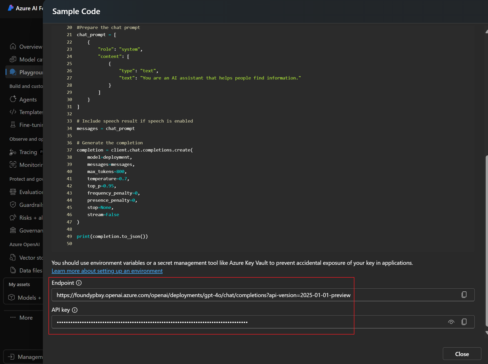

# Semantic Kernel Python Agents Workshop

## 🎯 Workshop 簡介

歡迎參加 **Semantic Kernel Python Agents Workshop**！本次 Workshop 將帶您深入了解如何使用 Semantic Kernel 建立智能代理系統，涵蓋三大核心領域：

### 🚀 Workshop 內容概覽與學習路徑

| 順序    | 實驗室                       | 主題             | 核心技術               | 適用場景                 | 參考文件路徑                                                                                                      |
| ------- | ---------------------------- | ---------------- | ---------------------- | ------------------------ | ----------------------------------------------------------------------------------------------------------------- |
| **0**   | **環境設定**                 | 基礎設定         | Python 環境、套件安裝  | 所有 SK Agent 開發       | [`0_setup/workshop.md`](../0_setup/workshop.md)                                                                   |
| **1**   | **Azure AI Agent Lab**       | 雲端託管代理服務 | Azure AI Agent Service | 企業級應用、工具整合     | [`azure_ai_agent_lab/azure_ai_agent.md`](../azure_ai_agent_lab/azure_ai_agent.md)                                 |
| **1.1** | **Azure AI Agent 實作任務**  | 實務應用         | 多功能學習助理         | 技術文件搜索、程式碼執行 | [`azure_ai_agent_lab/task/azure_ai_agent_lab_task.md`](../azure_ai_agent_lab/task/azure_ai_agent_lab_task.md)     |
| **2**   | **Multi-Agent Lab**          | 多代理協作系統   | 協調與編排             | 複雜任務、團隊協作       | [`multi_agent_orchestration_lab/multi.md`](../multi_agent_orchestration_lab/multi.md)                             |
| **2.1** | **Magentic 協調進階**        | 智能協調         | AI 指揮官架構          | 複雜問題分解與解決       | [`multi_agent_orchestration_lab/magentic.md`](../multi_agent_orchestration_lab/magentic.md)                       |
| **2.2** | **Sequential 協調詳解**      | 順序處理         | 取消機制、串流回調     | 流水線處理流程           | [`multi_agent_orchestration_lab/step2.md`](../multi_agent_orchestration_lab/step2.md)                             |
| **3**   | **Chat Completion Lab**      | 本地代理開發     | Semantic Kernel Core   | 快速原型、本地部署       | [`chat_completion_lab/chat_completion.md`](../chat_completion_lab/chat_completion.md)                             |
| **3.1** | **Chat Completion 實作任務** | 技術問題解決中心 | 多代理群組聊天         | 技術支援、問題診斷       | [`chat_completion_lab/task/chat_completion_lab_task.md`](../chat_completion_lab/task/chat_completion_lab_task.md) |

### 🎓 學習目標與進階路徑

#### 基礎目標
- 掌握 Semantic Kernel Python 代理開發基礎
- 了解 Azure AI Agent 與 Chat Completion Agent 的差異
- 學會多代理協作模式的設計與實作
- 建立完整的 AI 代理應用系統

#### 進階路徑
1. **入門階段**: 完成環境設定，運行測試腳本
2. **基礎階段**: 實作單一代理 (Azure AI Agent 或 Chat Completion)
3. **進階階段**: 學習多代理協作模式
4. **專家階段**: 完成各實驗室實作任務
5. **整合應用**: 將所學技術應用於自訂專案

---

## 🛠️ 環境設定指南

### 1. 系統需求檢查

#### Python 版本要求
```bash
# 檢查 Python 版本 (需要 3.8+)
python --version
```
**最低需求**: Python 3.12.10+

### 2. 虛擬環境建立

#### 下載專案並切換分支
```bash
# 下載 Semantic Kernel 專案原始碼
git clone https://github.com/payton-chou-ms/semantic-kernel.git

# 切換到 mylab 分支
cd semantic-kernel
git checkout mylab
```

#### 建立虛擬環境
```bash
# 建立虛擬環境
python -m venv .myvenv

# 啟動虛擬環境
# Windows
.myvenv\Scripts\activate

# macOS/Linux
source .myvenv/bin/activate

# 確認虛擬環境已啟動 (命令列前綴應顯示環境名稱)
```

#### 升級 pip 和安裝工具
```bash
# 升級 pip 到最新版本
python -m pip install --upgrade pip
```
**最低需求**: pip 25.1.1+

### 3. 套件安裝

#### 安裝 Semantic Kernel 依賴套件
```bash
# 安裝所有必要套件
pip install -r ./python/samples/getting_started_with_agents/0_setup/requirements.txt
```

### 4. Azure 服務設定

#### 必要的 Azure 資源
**Azure AI Foundry Project**
- Deploy standard setup: https://portal.azure.com/#create/Microsoft.Template/uri/https%3A%2F%2Fraw.githubusercontent.com%2Fazure-ai-foundry%2Ffoundry-samples%2Frefs%2Fheads%2Fmain%2Fsamples%2Fmicrosoft%2Finfrastructure-setup%2F41-standard-agent-setup%2Fazuredeploy.json
- Ref: https://learn.microsoft.com/en-us/azure/ai-foundry/agents/environment-setup
##### Azure AI Foundry Agent Service configuration
- Get AZURE_AI_AGENT_ENDPOINT
  
- Get AZURE_AI_AGENT_MODEL_DEPLOYMENT_NAME
  
- Sample format
```
  AZURE_AI_AGENT_ENDPOINT="https://<example-project-name>.services.ai.azure.com/api/projects/<example-project-name>"
  AZURE_AI_AGENT_MODEL_DEPLOYMENT_NAME="gpt-4.1"
```
###### Get Azure OpenAI Service configuration
- AZURE_OPENAI_CHAT_DEPLOYMENT_NAME="o4-mini"
- MY_AZURE_OPENAI_ENDPOINT="https://<example-project-name>.openai.azure.com/openai/deployments/<example-model-deployment-name>/chat/completions?api-version=<example-api-version>"
- AZURE_OPENAI_API_KEY="<example-api-key>"
- AZURE_OPENAI_API_VERSION="<example-api-version>"


- Sample format
```
  MY_AZURE_OPENAI_ENDPOINT="https://<example-project-name>.openai.azure.com/openai/deployments/<example-model-deployment-name>/chat/completions?api-version=<example-api-version>"
  AZURE_OPENAI_CHAT_DEPLOYMENT_NAME="o4-mini"
  AZURE_OPENAI_API_KEY="<example-api-key>"
  AZURE_OPENAI_API_VERSION="<example-api-version>"
```
---
### 5. Azure CLI 安裝
```base 
# For Windows
$ winget install -e --id Microsoft.AzureCLI

# For Linux
$ sudo apt-get install azure-cli

# For Alpine Linux (如 Codespace 無 apt-get 時)
$ sudo apk add --no-cache python3 py3-pip curl bash gcc musl-dev libffi-dev openssl-dev cargo
$ pip install azure-cli

# Check Azure CLI version
$ az version
```
**最低需求**: azure-cli 2.62.0+
## ⚙️ 環境變數設定
### 快速設定與驗證
在以下路徑中設定環境變數 `.env` 檔案，建議所有實驗室目錄都設定以確保一致性：

```bash
# 主要 .env 檔案路徑
python/samples/getting_started_with_agents/0_setup/.env                      # 環境測試用
python/samples/getting_started_with_agents/azure_ai_agent_lab/.env           # Azure AI Agent 實驗室
python/samples/getting_started_with_agents/azure_ai_agent_lab/task/.env      # Azure AI Agent 實作任務
python/samples/getting_started_with_agents/chat_completion_lab/.env          # Chat Completion 實驗室
python/samples/getting_started_with_agents/chat_completion_lab/task/.env     # Chat Completion 實作任務
python/samples/getting_started_with_agents/multi_agent_orchestration_lab/.env # Multi-Agent 實驗室
python/samples/concepts/agents/azure_ai_agent_lab/.env                       # 概念示例
```

#### 1. 設定 .env 檔案
```bash
# 編輯 .env 檔案
code .env
```

#### 2. 必要環境變數說明

```bash
# === Azure AI Foundry Agent 設定 ===
# Azure AI Agent 服務端點與模型名稱
AZURE_AI_AGENT_ENDPOINT="https://<project-name>.services.ai.azure.com/api/projects/<project-name>"
AZURE_AI_AGENT_MODEL_DEPLOYMENT_NAME="gpt-4.1"

# Used for Azure OpenAI Service configuration
AZURE_OPENAI_CHAT_DEPLOYMENT_NAME="o4-mini"
MY_AZURE_OPENAI_ENDPOINT="https://<example-project-name>.openai.azure.com/openai/deployments/<example-model-deployment-name>/chat/completions?api-version=<example-api-version>"
AZURE_OPENAI_API_KEY="<example-api-key>"
AZURE_OPENAI_API_VERSION="<example-api-version>"
```
---

## 🧪 環境測試腳本

### 環境測試總覽
我們提供三個測試腳本來驗證不同實驗室的環境設定：

| 測試腳本                  | 測試內容                 | 對應實驗室          |
| ------------------------- | ------------------------ | ------------------- |
| `test_azure_ai_agent.py`  | Azure AI Agent 服務連線  | Azure AI Agent Lab  |
| `test_chat_completion.py` | Chat Completion 服務連線 | Chat Completion Lab |
| `test_multi_agent.py`     | 多代理協調功能           | Multi-Agent Lab     |

### 執行環境測試
```bash
$ az login
$ python test_azure_ai_agent.py
$ python test_chat_completion.py  
$ python test_multi_agent.py
如果一切順利, 可以看到環境測試完成的輸出
```

## 📚 Workshop 實驗室簡介

### 實驗室 1: Azure AI Agent Lab

#### 🎯 學習目標
- 掌握 Azure AI Agent 服務的使用
- 了解雲端託管代理的優勢
- 學會整合強大的 Azure 工具

#### 🔧 核心技術
- **AzureAIAgent**: 雲端託管的智能代理
- **Azure工具整合**: CodeInterpreter、FileSearch、OpenAPI
- **身份認證**: DefaultAzureCredential

#### 📋 實作範例 (8個步驟)
1. **基本對話代理** - 建立您的第一個 Azure AI 代理
2. **插件增強代理** - 使用 Semantic Kernel 插件擴展功能
3. **群組聊天代理** - 多代理協作對話
4. **程式碼解釋器** - 執行 Python 程式碼分析資料
5. **檔案搜尋代理** - 智能文件檢索與問答
6. **OpenAPI 整合** - 連接外部 API 服務
7. **現有代理檢索** - 重用已建立的代理
8. **宣告式代理** - 使用 YAML 配置建立代理

#### 🧩 實作任務
- **多功能學習助理**: 整合檔案搜尋、程式碼執行和學習追蹤功能
- **參考文件**: [`azure_ai_agent_lab/task/azure_ai_agent_lab_task.md`](../azure_ai_agent_lab/task/azure_ai_agent_lab_task.md)

#### 💼 適用場景
- 企業級 AI 應用
- 資料分析與處理
- 文件管理系統
- API 整合平台

### 實驗室 2: Multi-Agent Orchestration Lab

#### 🎯 學習目標
- 掌握多代理協作模式
- 了解複雜任務分解策略
- 學會設計智能工作流程

#### 🔧 核心技術
- **ConcurrentOrchestration**: 並行協調
- **SequentialOrchestration**: 順序協調
- **GroupChatOrchestration**: 群組聊天協調
- **HandoffOrchestration**: 交接協調
- **MagenticOrchestration**: 智能協調

#### 📋 實作範例 (5個協調模式)
1. **並行協調** - 多專家同時分析
2. **順序協調** - 流水線處理流程
3. **群組聊天** - 多方協作討論
4. **交接協調** - 動態任務分流
5. **Magentic協調** - 複雜任務解決

#### 🧩 進階學習
- **Magentic 協調進階**: AI 指揮官與其他模式的差異比較
- **參考文件**: [`multi_agent_orchestration_lab/magentic.md`](../multi_agent_orchestration_lab/magentic.md)
- **Sequential 協調詳解**: 取消機制與串流回調
- **參考文件**: [`multi_agent_orchestration_lab/step2.md`](../multi_agent_orchestration_lab/step2.md)

#### 💼 適用場景
- 複雜業務流程
- 創意協作平台
- 客服分流系統
- 智能決策支援

### 實驗室 3: Chat Completion Agent Lab

#### 🎯 學習目標
- 掌握本地代理開發技術
- 了解 Semantic Kernel 核心概念
- 學會快速原型開發

#### 🔧 核心技術
- **ChatCompletionAgent**: 本地執行的智能代理
- **Plugin系統**: 自訂功能擴展
- **結構化輸出**: Pydantic 模型整合

#### 📋 實作範例 (12個步驟)
1. **基礎聊天代理** - 最簡單的代理實作
2. **對話歷史管理** - 維護多輪對話記憶
3. **Kernel 整合** - 標準化服務管理
4. **簡單插件功能** - 擴展代理能力
5. **自動函數調用** - 智能函數執行
6. **多代理群組聊天** - 代理協作
7. **智能策略控制** - AI 驅動的代理選擇
8. **結構化輸出** - 格式化結果輸出
9. **日誌與監控** - 開發調試支援
10. **結構化推理** - 詳細推理過程
11. **聲明式配置** - YAML 驅動創建
12. **代碼解釋器** - 動態代碼執行

#### 🧩 實作任務
- **技術問題解決中心**: 使用多代理群組聊天進行問題診斷與解決
- **參考文件**: [`chat_completion_lab/task/chat_completion_lab_task.md`](../chat_completion_lab/task/chat_completion_lab_task.md)

#### 💼 適用場景
- 快速原型開發
- 本地 AI 應用
- 學習與研究
- 客製化解決方案

---

## 📝 學習資源與參考資料

### 核心文件
- **Workshop 指南**: [`0_setup/workshop.md`](../0_setup/workshop.md)
- **Azure AI Agent 指南**: [`azure_ai_agent_lab/azure_ai_agent.md`](../azure_ai_agent_lab/azure_ai_agent.md)
- **Multi-Agent 協調指南**: [`multi_agent_orchestration_lab/multi.md`](../multi_agent_orchestration_lab/multi.md)
- **Chat Completion 指南**: [`chat_completion_lab/chat_completion.md`](../chat_completion_lab/chat_completion.md)

### 進階文件
- **Magentic 協調解析**: [`multi_agent_orchestration_lab/magentic.md`](../multi_agent_orchestration_lab/magentic.md)
- **Sequential 協調詳解**: [`multi_agent_orchestration_lab/step2.md`](../multi_agent_orchestration_lab/step2.md)

### 實作任務
- **Azure AI Agent 任務**: [`azure_ai_agent_lab/task/azure_ai_agent_lab_task.md`](../azure_ai_agent_lab/task/azure_ai_agent_lab_task.md)
- **Chat Completion 任務**: [`chat_completion_lab/task/chat_completion_lab_task.md`](../chat_completion_lab/task/chat_completion_lab_task.md)

### 外部資源
- [Semantic Kernel GitHub](https://github.com/microsoft/semantic-kernel)
- [Azure AI Foundry](https://ai.azure.com)
- [Azure OpenAI 文件](https://learn.microsoft.com/zh-tw/azure/ai-services/openai/)

**Happy Coding! 🚀**
