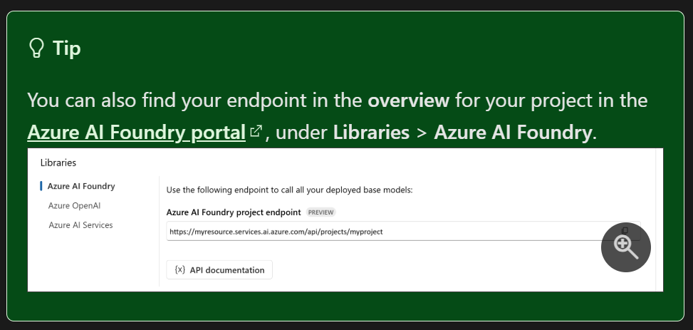
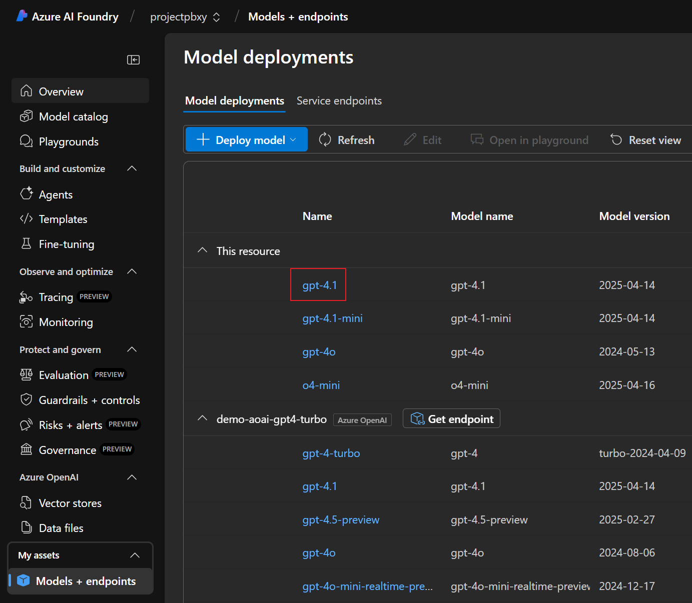
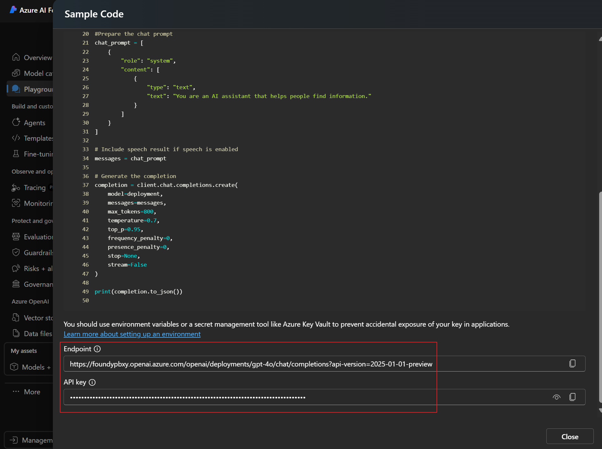

# Semantic Kernel Python Agents Workshop

## 🎯 Workshop 簡介

歡迎參加 **Semantic Kernel Python Agents Workshop**！本次 Workshop 將帶您深入了解如何使用 Semantic Kernel 建立智能代理系統，涵蓋三大核心領域：

### 🚀 Workshop 內容概覽

| 實驗室                  | 主題             | 核心技術               | 適用場景             |
| ----------------------- | ---------------- | ---------------------- | -------------------- |
| **Azure AI Agent Lab**  | 雲端託管代理服務 | Azure AI Agent Service | 企業級應用、工具整合 |
| **Chat Completion Lab** | 本地代理開發     | Semantic Kernel Core   | 快速原型、本地部署   |
| **Multi-Agent Lab**     | 多代理協作系統   | 協調與編排             | 複雜任務、團隊協作   |

### 🎓 學習目標

- 掌握 Semantic Kernel Python 代理開發基礎
- 了解 Azure AI Agent 與 Chat Completion Agent 的差異
- 學會多代理協作模式的設計與實作
- 建立完整的 AI 代理應用系統

---

## 🛠️ 環境設定指南

### 1. 系統需求檢查

#### Python 版本要求
```bash
# 檢查 Python 版本 (需要 3.8+)
python --version

# 檢查 pip 版本
pip --version
```

**最低需求**: Python 3.12.10+, pip 25.1.1+

#### 支援的作業系統
- Windows 11

### 2. 虛擬環境建立

#### 建立虛擬環境
```bash
# 建立虛擬環境
python -m venv .myvenv

# 啟動虛擬環境
# Windows
.myvenv\Scripts\activate

# macOS/Linux
source .myvenv/Scripts/activate

# 確認虛擬環境已啟動 (命令列前綴應顯示環境名稱)
```

#### 升級 pip 和安裝工具
```bash
# 升級 pip 到最新版本
python -m pip install --upgrade pip
```

### 3. 套件安裝

#### 安裝 Semantic Kernel 依賴套件
```bash
# 安裝所有必要套件
pip install -r requirements.txt
```

### 4. Azure 服務設定

#### 必要的 Azure 資源
**Azure AI Foundry Project**
- Deploy standard setup: https://portal.azure.com/#create/Microsoft.Template/uri/https%3A%2F%2Fraw.githubusercontent.com%2Fazure-ai-foundry%2Ffoundry-samples%2Frefs%2Fheads%2Fmain%2Fsamples%2Fmicrosoft%2Finfrastructure-setup%2F41-standard-agent-setup%2Fazuredeploy.json
- Ref: https://learn.microsoft.com/en-us/azure/ai-foundry/agents/environment-setup
#### 取得 Azure 資源資訊
- Get AZURE_AI_AGENT_ENDPOINT [Link](https://learn.microsoft.com/en-us/azure/ai-foundry/agents/quickstart?pivots=programming-language-python-azure)
  
- Get AZURE_AI_AGENT_MODEL_DEPLOYMENT_NAME
  
# Get MY_AZURE_OPENAI_ENDPOINT, AZURE_OPENAI_CHAT_DEPLOYMENT_NAME, AZURE_OPENAI_API_KEY, AZURE_OPENAI_API_VERSION
- AZURE_OPENAI_CHAT_DEPLOYMENT_NAME="o4-mini"
- MY_AZURE_OPENAI_ENDPOINT="https://<example-project-name>.openai.azure.com/openai/deployments/<example-model-deployment-name>/chat/completions?api-version=<example-api-version>"
- AZURE_OPENAI_API_KEY="<example-api-key>"
- AZURE_OPENAI_API_VERSION="<example-api-version>"




---
### 5. Azure CLI 安裝
```base 
$ winget install -e --id Microsoft.AzureCLI
```
## ⚙️ 環境變數設定
### 快速設定與驗證
```bash
# 1. 複製 .env 範本
cp .env.example .env

# 2. 編輯 .env，至少填入下列關鍵值
# Used for Azure AI Foundry Agent Service configuration
AZURE_AI_AGENT_ENDPOINT="https://<example-project-name>.services.ai.azure.com/api/projects/<example-project-name>"
AZURE_AI_AGENT_MODEL_DEPLOYMENT_NAME="gpt-4.1"

# Used for Azure OpenAI Service configuration
# https://learn.microsoft.com/en-us/semantic-kernel/frameworks/agent/examples/example-chat-agent?pivots=programming-language-python
AZURE_OPENAI_CHAT_DEPLOYMENT_NAME="o4-mini"
# AZURE_OPENAI_ENDPOINT="https://<example-project-name>.openai.azure.com/openai/deployments/<example-model-deployment-name>/chat/completions?api-version=<example-api-version>"
MY_AZURE_OPENAI_ENDPOINT="https://<example-project-name>.openai.azure.com/openai/deployments/<example-model-deployment-name>/chat/completions?api-version=<example-api-version>"
AZURE_OPENAI_API_KEY="<example-api-key>"
AZURE_OPENAI_API_VERSION="<example-api-version>"
```
---

## 🧪 環境測試腳本

### 環境測試總覽
我們提供三個測試腳本來驗證不同實驗室的環境設定：

| 測試腳本                  | 測試內容                 | 對應實驗室          |
| ------------------------- | ------------------------ | ------------------- |
| `test_azure_ai_agent.py`  | Azure AI Agent 服務連線  | Azure AI Agent Lab  |
| `test_chat_completion.py` | Chat Completion 服務連線 | Chat Completion Lab |
| `test_multi_agent.py`     | 多代理協調功能           | Multi-Agent Lab     |

### 執行環境測試
```bash
$ az login
$ python test_azure_ai_agent.py
$ python test_chat_completion.py  
$ python test_multi_agent.py
如果一切順利, 可以看到環境測試完成的輸出
```
## 📚 Workshop 實驗室簡介

### 實驗室 1: Azure AI Agent Lab

#### 🎯 學習目標
- 掌握 Azure AI Agent 服務的使用
- 了解雲端託管代理的優勢
- 學會整合強大的 Azure 工具

#### 🔧 核心技術
- **AzureAIAgent**: 雲端託管的智能代理
- **Azure工具整合**: CodeInterpreter、FileSearch、OpenAPI
- **身份認證**: DefaultAzureCredential

#### 📋 實作範例 (8個步驟)
1. **基本對話代理** - 建立您的第一個 Azure AI 代理
2. **插件增強代理** - 使用 Semantic Kernel 插件擴展功能
3. **群組聊天代理** - 多代理協作對話
4. **程式碼解釋器** - 執行 Python 程式碼分析資料
5. **檔案搜尋代理** - 智能文件檢索與問答
6. **OpenAPI 整合** - 連接外部 API 服務
7. **現有代理檢索** - 重用已建立的代理
8. **宣告式代理** - 使用 YAML 配置建立代理

#### 💼 適用場景
- 企業級 AI 應用
- 資料分析與處理
- 文件管理系統
- API 整合平台

### 實驗室 2: Chat Completion Agent Lab

#### 🎯 學習目標
- 掌握本地代理開發技術
- 了解 Semantic Kernel 核心概念
- 學會快速原型開發

#### 🔧 核心技術
- **ChatCompletionAgent**: 本地執行的智能代理
- **Plugin系統**: 自訂功能擴展
- **結構化輸出**: Pydantic 模型整合

#### 📋 實作範例 (12個步驟)
1. **基礎聊天代理** - 最簡單的代理實作
2. **對話歷史管理** - 維護多輪對話記憶
3. **Kernel 整合** - 標準化服務管理
4. **簡單插件功能** - 擴展代理能力
5. **自動函數調用** - 智能函數執行
6. **多代理群組聊天** - 代理協作
7. **智能策略控制** - AI 驅動的代理選擇
8. **結構化輸出** - 格式化結果輸出
9. **日誌與監控** - 開發調試支援
10. **結構化推理** - 詳細推理過程
11. **聲明式配置** - YAML 驅動創建
12. **代碼解釋器** - 動態代碼執行

#### 💼 適用場景
- 快速原型開發
- 本地 AI 應用
- 學習與研究
- 客製化解決方案

### 實驗室 3: Multi-Agent Orchestration Lab

#### 🎯 學習目標
- 掌握多代理協作模式
- 了解複雜任務分解策略
- 學會設計智能工作流程

#### 🔧 核心技術
- **ConcurrentOrchestration**: 並行協調
- **SequentialOrchestration**: 順序協調
- **GroupChatOrchestration**: 群組聊天協調
- **HandoffOrchestration**: 交接協調
- **MagenticOrchestration**: 智能協調

#### 📋 實作範例 (5個協調模式)
1. **並行協調** - 多專家同時分析
2. **順序協調** - 流水線處理流程
3. **群組聊天** - 多方協作討論
4. **交接協調** - 動態任務分流
5. **Magentic協調** - 複雜任務解決

#### 💼 適用場景
- 複雜業務流程
- 創意協作平台
- 客服分流系統
- 智能決策支援

---

#### 資源
- [Semantic Kernel GitHub](https://github.com/microsoft/semantic-kernel)
- [Azure AI Foundry](https://ai.azure.com)

**Happy Coding! 🚀**
